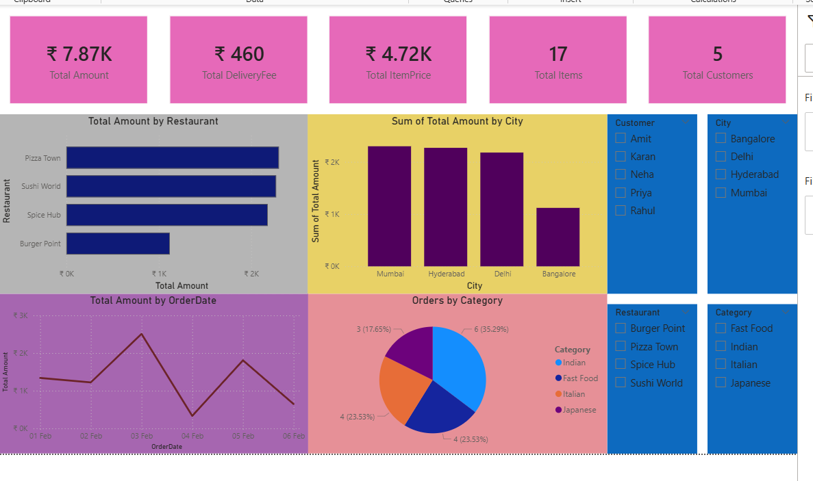

## Food Delivery Data Analysis

### Objective
Analyze food delivery data to understand revenue trends, restaurant performance, and customer behavior.

### Tools Used
- Excel
- SQL
- Python (Pandas, Matplotlib)
- Power BI

### Analysis Performed
- Calculated total revenue using item price, quantity, and delivery fee
- Analyzed revenue by restaurant and city
- Identified order distribution by category
- Visualized trends using bar charts and pie charts

### Key Insights
- Certain restaurants generate significantly higher revenue
- City-wise performance shows uneven distribution
- Some categories dominate total orders
- Revenue trends vary across locations and categories

### Files Included
- data.xlsx → Raw dataset
- analysis.sql → SQL queries
- analysis.py → Python analysis and visualization
- dashboard.pbix → Power BI dashboard
- food.orders.dashboard.png → Screenshot of Dashboard 
